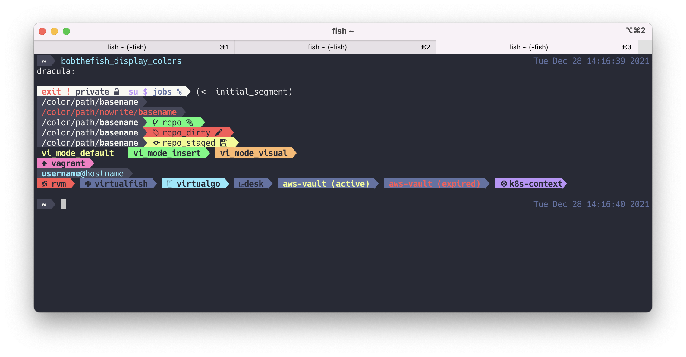

# Dracula for [bobthefish](https://github.com/oh-my-fish/theme-bobthefish)

> A dark theme for [bobthefish](https://github.com/oh-my-fish/theme-bobthefish).

## Install

All instructions can be found at [draculatheme.com/bobthefish](https://draculatheme.com/bobthefish).

## Team

This theme is maintained by the [bobthefish](https://github.com/oh-my-fish/theme-bobthefish) team.

|  |
| --------------------------------------------------------------------------------------------- |
| [xsteadfastx](https://github.com/xsteadfastx)                                                 |

## Community

- [Twitter](https://twitter.com/draculatheme) - Best for getting updates about themes and new stuff.
- [GitHub](https://github.com/dracula/dracula-theme/discussions) - Best for asking questions and discussing issues.
- [Discord](https://draculatheme.com/discord-invite) - Best for hanging out with the community.

## License

[MIT License](./LICENSE)
